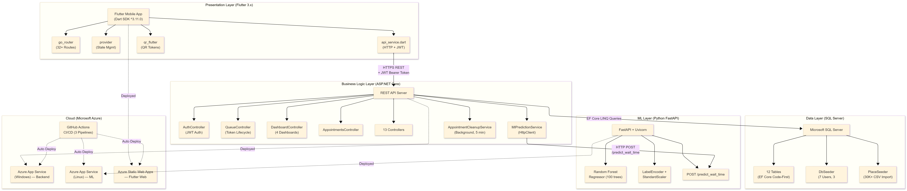

<p align="center">
  
</p>

<h1 align="center">IntelliQ — Smart Queue Prediction System</h1>

<p align="center">
  <b>Eliminate physical wait times with AI-powered queue management</b><br/>
  A full-stack platform for real-time digital tokens, live queue tracking, and ML-predicted slot recommendations
</p>

<p align="center">
  <a href="https://lemon-meadow-00c80f500.7.azurestaticapps.net/">
    
  </a>
</p>

<p align="center">
  
  
  
  
  
  
</p>

---

## 📌 Table of Contents

- [Overview](#-overview)
- [Live Demo](#-live-demo)
- [Key Features](#-key-features)
- [Tech Stack](#️-tech-stack)
- [Repository Structure](#-repository-structure)
- [Architecture](#-architecture)
- [Deployment](#-deployment)
- [Getting Started](#-getting-started)
  - [Backend Setup](#1-backend-aspnet-core)
  - [ML API Setup](#2-ml-prediction-api-fastapi)
  - [Frontend Setup](#3-frontend-flutter)
- [Test Credentials](#-test-credentials)
- [API Overview](#-api-overview)
- [ML Model](#-ml-model)
- [Version History](#-version-history)
- [Contributing](#-contributing)

---

## 🧠 Overview

**IntelliQ** is an intelligent, full-stack queue management platform built to eliminate the frustration of physical waiting at high-traffic service locations — hospitals, banks, colleges, and restaurants.

Users can **book digital tokens**, **track their live position** in the queue, and receive **AI-powered slot recommendations** that predict the optimal time to arrive based on historical crowd patterns. Staff can manage counters and advance queues in real time. Admins get powerful dashboards to manage services, staff, counters, and view analytics — all in real time. Super Admins oversee the entire platform and manage provider registrations.

---

## 🌐 Live Demo

The application is fully deployed and accessible online:

| Service | URL |
|---------|-----|
| 🖥️ **Frontend (Web App)** | [lemon-meadow-00c80f500.7.azurestaticapps.net](https://lemon-meadow-00c80f500.7.azurestaticapps.net/) |
| ⚙️ **Backend API** | [intelliq-api.azurewebsites.net/api](https://intelliq-api.azurewebsites.net/api) |
| 🤖 **ML Prediction API** | [intelliq-ml.azurewebsites.net](https://intelliq-ml.azurewebsites.net) |

> 💡 Use the [Test Credentials](#-test-credentials) below to explore all roles.

---

## 🌟 Key Features

### 👤 For Users
| Feature | Description |
|--------|-------------|
| 🔍 **Smart Search** | Discover nearby hospitals, banks, colleges, and restaurants from a pre-seeded database |
| 🤖 **AI Smart Slots** | ML-predicted time slot recommendations based on wait time, crowd level & capacity |
| 📱 **Digital Tokens** | QR-code based tokens with appointment details for contactless check-in |
| 📍 **Live Queue Tracking** | Real-time position updates — know exactly when it's your turn |
| 📅 **Appointment Booking** | Book, view, and manage upcoming appointments from a unified dashboard |
| 🔔 **Notifications** | In-app alerts for token calls, status changes, and confirmations |
| 📊 **User Statistics** | Personal visit analytics, time saved metrics, and booking history |
| 🧠 **AI Analysis** | AI-powered insights on queue patterns and personalized recommendations |
| 🌙 **Dark Mode** | Per-user dark/light mode preference, persisted across sessions |
| 🗑️ **Account Deletion** | Request account deletion with admin approval workflow |

### 🧑‍💼 For Staff
| Feature | Description |
|--------|-------------|
| 🖥️ **Counter Management** | Update active token, move queue forward in real time |
| 📋 **Live Queue View** | See full list of waiting, serving, and completed tokens |
| 📊 **Staff Dashboard** | Personal performance metrics and recent activity log |

### 🛡️ For Admins
| Feature | Description |
|--------|-------------|
| 📊 **Analytics Dashboard** | Service-level stats, daily token volume, and wait-time trends |
| 🤖 **AI Predictions** | Visualize ML model insights and crowd predictions |
| 👥 **Role Management** | Assign Admin / Staff roles with granular access |
| 🏥 **Service Management** | Add, edit, and manage service types per provider |
| 🔢 **Counter & Staff Assignment** | Map staff members to specific service counters |
| 📆 **Appointment Management** | View and manage all appointments across the provider |
| 📋 **Queue Management** | Monitor and manage active queues |

### 👑 For Super Admins
| Feature | Description |
|--------|-------------|
| 🏢 **Provider Management** | Manage all service providers across the platform |
| ✅ **Claim Approval** | Approve/reject provider claim requests from organizations |
| 👥 **User Management** | View all users, handle account deletion requests |
| 📊 **Platform Overview** | Global stats across all providers, categories, and users |

---

## 🛠️ Tech Stack

| Layer | Technology |
|-------|-----------|
| **Frontend** | Flutter 3.x (Dart) — cross-platform Web/Android/iOS |
| **Backend API** | ASP.NET Core 9 (C#) — REST API with JWT Auth |
| **Database** | Microsoft SQL Server + Entity Framework Core |
| **ML Models** | Python · scikit-learn (Random Forest Regressor + Linear Regression) |
| **ML Serving** | FastAPI + Uvicorn |
| **State Management** | Flutter `provider` package |
| **Navigation** | `go_router` (Flutter) |
| **UI Components** | Glassmorphism UI, custom floating capsule nav bar, QR flutter |
| **Cloud** | Azure Static Web Apps (Frontend) · Azure App Service (Backend + ML) |
| **CI/CD** | GitHub Actions — automated build & deploy pipelines |

---

## 📁 Repository Structure

```
Smart-Queue-Prediction/
│
├── .github/workflows/               # CI/CD Pipelines
│   ├── deploy-frontend.yml          # Flutter → Azure Static Web Apps
│   ├── deploy-backend.yml           # ASP.NET → Azure App Service
│   └── deploy-ml.yml                # FastAPI → Azure App Service (Linux)
│
├── Frontend/                         # Flutter App
│   ├── lib/
│   │   ├── main.dart
│   │   ├── models/                  # Dart data models (QueueToken, Appointment, etc.)
│   │   ├── screens/
│   │   │   ├── user/                # 19 screens — home, booking, tracking, tokens,
│   │   │   │                        #   profile, notifications, AI analysis, statistics,
│   │   │   │                        #   smart slots, about, help & support
│   │   │   ├── staff/               # Staff dashboard, queue management
│   │   │   ├── admin/               # Analytics, AI predictions, services, counters,
│   │   │   │                        #   roles, appointments, queue management
│   │   │   └── super_admin/         # Platform dashboard, user management
│   │   ├── services/
│   │   │   ├── api_service.dart     # All HTTP calls to backend (Azure API)
│   │   │   └── auth_provider.dart   # Auth + theme state management
│   │   ├── utils/
│   │   │   ├── router.dart          # go_router navigation config
│   │   │   └── theme.dart           # AppTheme with dark/light mode support
│   │   └── widgets/                 # Reusable widgets (nav bar, smart search bar)
│   └── pubspec.yaml
│
├── backend/                          # ASP.NET Core API
│   └── Smart_Queue/
│       ├── Controllers/              # 13 REST controllers (Auth, Queue, Appointments,
│       │                             #   Staff, Dashboard, Places, Claims, Account...)
│       ├── Models/                   # EF Core entity models
│       ├── DTOs/                     # Data Transfer Objects
│       ├── Services/                 # Business logic (Queue, Dashboard, ML Prediction,
│       │                             #   Appointment Cleanup)
│       ├── Data/                     # DbContext + DbSeeder (pre-seeded providers)
│       ├── Migrations/               # EF Core database migrations
│       └── Program.cs                # App startup, DI, JWT, CORS config
│
├── ml/                               # ML Model & Prediction API
│   ├── train_model.py                # Linear Regression training pipeline
│   ├── train_rf_model.py             # Random Forest Regressor training pipeline
│   ├── api.py                        # FastAPI prediction endpoint (Linear Regression)
│   ├── api/app.py                    # FastAPI endpoint (Random Forest)
│   ├── models/
│   │   ├── linear_model.pkl          # Trained Linear Regression model
│   │   ├── random_forest_model.pkl   # Trained Random Forest model
│   │   └── metadata.pkl              # Feature names, encoders, scaler
│   ├── dataset/                      # Training datasets (CSV)
│   ├── notebook/                     # Jupyter notebooks for EDA & experimentation
│   └── requirements.txt
│
├── Datasets_Clean/                   # Cleaned source datasets by category
│   ├── Banks_Clean.csv
│   ├── Hospitals_Clean.csv
│   ├── Colleges_Clean.csv
│   └── Restaurants_Clean.csv
│
├── doc/                              # Project documentation & reports
├── AppLogo.png
└── Logo.png
```

---

## 🏗️ Architecture


---

## ☁️ Deployment

All three services are deployed to Azure with automated CI/CD via GitHub Actions:

| Service | Platform | Trigger |
|---------|----------|---------|
| **Frontend** | Azure Static Web Apps | Push to `main` (changes in `Frontend/`) |
| **Backend API** | Azure App Service (Windows) | Push to `main` (changes in `backend/`) |
| **ML API** | Azure App Service (Linux) | Push to `main` (changes in `ml/`) |

Each service has its own GitHub Actions workflow in `.github/workflows/` that automatically builds and deploys on push.

---

## 🚀 Getting Started

> **Note:** The app is already live at [lemon-meadow-00c80f500.7.azurestaticapps.net](https://lemon-meadow-00c80f500.7.azurestaticapps.net/). Follow these steps only if you want to run locally.

### Prerequisites

- [Flutter SDK](https://docs.flutter.dev/get-started/install) (3.x stable)
- [.NET 9.0 SDK](https://dotnet.microsoft.com/en-us/download/dotnet/9.0)
- [SQL Server](https://www.microsoft.com/en-us/sql-server/sql-server-downloads) (or SQL Server Express)
- [Python 3.10+](https://www.python.org/downloads/)

---

### 1. Backend (ASP.NET Core)

```bash
# Navigate to backend
cd backend/Smart_Queue
```

Update `appsettings.json` with your SQL Server connection string:
```json
"ConnectionStrings": {
  "DefaultConnection": "Server=YOUR_SERVER;Database=SmartQueueDb;Trusted_Connection=True;MultipleActiveResultSets=true;Encrypt=False"
}
```

Run migrations and start the server:
```bash
dotnet ef database update   # Creates schema + seeds initial provider data
dotnet run                  # Starts API at http://localhost:5164
```

> ✅ The `DbSeeder.cs` will automatically populate hospitals, banks, colleges, and restaurants on first run.

---

### 2. ML Prediction API (FastAPI)

```bash
# Navigate to ml directory
cd ml

# Install dependencies
pip install -r requirements.txt

# Train the models
python train_model.py        # Linear Regression model
python train_rf_model.py     # Random Forest model

# Start the prediction server
python api.py
# Runs at http://localhost:8000
```

Test it:
```bash
curl -X POST http://localhost:8000/predict_wait_time \
  -H "Content-Type: application/json" \
  -d '{"features": {"service_type": "Hospital", "hour_of_day": 10, "queue_length": 5}}'
```

---

### 3. Frontend (Flutter)

```bash
# Navigate to frontend
cd Frontend

# Install dependencies
flutter pub get
```

Update the API base URL in `lib/services/api_service.dart`:
```dart
// For Azure Production (default)
return 'https://intelliq-api.azurewebsites.net/api';

// For Local Development
return 'http://localhost:5164/api';
```

Run the app:
```bash
flutter run -d chrome    # Run as web app
flutter run              # Run on connected device
```

---

## 🔑 Test Credentials

> Use this account to explore user role in the app:

| Role | Email | Password |
|------|-------|----------|
| 👤 User | `user@intelliq.com` | `User@123` |

---

## 📡 API Overview

**Base URL:**
- **Production:** `https://intelliq-api.azurewebsites.net/api`
- **Local:** `http://localhost:5164/api`

| Method | Endpoint | Description |
|--------|----------|-------------|
| `POST` | `/auth/register` | Register a new user |
| `POST` | `/auth/login` | Login and receive JWT token |
| `GET` | `/queue/{providerId}` | Get live queue for a provider |
| `POST` | `/queue/join` | Join a queue and get digital token |
| `POST` | `/queue/next/{counterId}` | Advance queue to next token (Staff) |
| `GET` | `/appointments` | Get user's appointments |
| `POST` | `/appointments` | Book a new appointment |
| `GET` | `/services/{providerId}` | List services for a provider |
| `GET` | `/dashboard/user` | User dashboard stats |
| `GET` | `/dashboard/admin` | Admin analytics data |
| `GET` | `/dashboard/staff` | Staff dashboard data |
| `GET` | `/dashboard/superadmin` | Super Admin platform overview |
| `GET` | `/notifications` | Get user notifications |
| `GET` | `/places/search?q=hospital` | Search service providers |
| `GET` | `/account/profile` | Get user profile |
| `PUT` | `/account/profile` | Update user profile |
| `POST` | `/account/deletion-request` | Request account deletion |
| `GET` | `/claims` | Get provider claim requests |

> All protected routes require `Authorization: Bearer <JWT_TOKEN>` header.

---

## 🤖 ML Model

The AI slot prediction system uses **two trained models** for estimating queue wait times:

### Models

| Model | File | Use Case |
|-------|------|----------|
| **Linear Regression** | `ml/models/linear_model.pkl` | Lightweight, fast inference for basic predictions |
| **Random Forest Regressor** | `ml/models/random_forest_model.pkl` | Higher accuracy with ensemble learning |

### Features Used
- Service type (Hospital / Bank / College / Restaurant)
- Day of week & Hour of day
- Current queue length & queue position
- Provider capacity & average service duration
- Historical average wait time
- Active staff count & service counters
- Priority level & customer type
- Peak hours indicator & holiday flag

### Output
Estimated wait time in minutes — used by the app to recommend the best time slots and power the AI Smart Slot feature.

### Files
| File | Description |
|------|-------------|
| `ml/train_model.py` | Linear Regression training pipeline |
| `ml/train_rf_model.py` | Random Forest training pipeline |
| `ml/api.py` | FastAPI endpoint (Linear Regression) |
| `ml/api/app.py` | FastAPI endpoint (Random Forest) |
| `ml/dataset/` | Training datasets (CSV) |
| `ml/notebook/` | Jupyter notebooks for EDA & experimentation |
| `ml/models/` | Serialized model (`.pkl`) artifacts |

---

## 📈 Version History

A timeline of the project's growth from a concept to a fully deployed system:

---

### `v0.1` — Project Foundation *(Sprint 1)*
> 🗓️ Initial setup & planning phase

- [x] Defined project scope, problem statement, and use cases
- [x] Designed database schema and ER diagram
- [x] Set up ASP.NET Core project structure with EF Core
- [x] Created initial SQL Server database with basic `User` and `ServiceProvider` models
- [x] Set up Flutter project with basic folder structure
- [x] Initial `README.md` and project documentation

---

### `v0.25` — Core Frontend & Backend *(Sprint 2)*
> 🗓️ Authentication, screens, and REST API foundation

- [x] **Backend:** JWT authentication system (`AuthController` — register, login, role-based tokens)
- [x] **Backend:** Core REST endpoints for Queue, Appointments, Services, Counters
- [x] **Backend:** Entity Framework migrations and `DbSeeder.cs` with pre-seeded Hospitals, Banks, Colleges, Restaurants
- [x] **Frontend:** Full Flutter navigation using `go_router` with role-based routing
- [x] **Frontend:** User screens — Login, Register, Home Dashboard, Service Selection, Appointment Booking
- [x] **Frontend:** Admin screens — Admin Login, Admin Dashboard, Service & Staff Management
- [x] **Frontend:** Staff screens — Staff Dashboard, Live Queue View
- [x] **Frontend:** Glassmorphism UI design system with custom floating capsule nav bar
- [x] **Frontend:** `api_service.dart` integration — all screens wired to live backend

---

### `v0.5` — Queue Intelligence & Digital Tokens *(Sprint 3)*
> 🗓️ Real-time queue tracking and QR token generation

- [x] **Backend:** `QueueController` — join queue, advance token, live position tracking
- [x] **Backend:** `NotificationsController` — in-app alert system
- [x] **Backend:** Role management with Super Admin provider claim flow
- [x] **Frontend:** Digital Token screen with QR code generation (`qr_flutter`)
- [x] **Frontend:** Live Queue Tracking screen with real-time position updates
- [x] **Frontend:** My Tokens screen — active, upcoming, and completed token history
- [x] **Frontend:** Notifications screen
- [x] **Frontend:** Booking Confirmation screen with token summary

---

### `v0.75` — ML Model & AI Slot Prediction *(Sprint 4)*
> 🗓️ Machine learning integration and analytics

- [x] **ML:** Collected and cleaned queue management datasets (Banks, Hospitals, Restaurants, Colleges)
- [x] **ML:** Trained Linear Regression model for wait time prediction
- [x] **ML:** Built FastAPI prediction server (`api.py`) serving `/predict_wait_time` endpoint
- [x] **Backend:** `MlPredictionService.cs` — .NET service calling the Python ML API
- [x] **Frontend:** Smart Slot screen — AI-recommended time slots with predicted wait times
- [x] **Frontend:** AI Prediction screen (Admin) — visualize model insights
- [x] **Frontend:** Analytics Dashboard — token volume, service stats, daily trends
- [x] **Backend:** `DashboardController` + `DashboardService` for aggregated analytics

---

### `v0.9` — Azure Cloud Deployment & Dark Mode *(Sprint 5)*
> 🗓️ Cloud-ready release with CI/CD and full feature completeness

- [x] **Cloud:** Automated CI/CD pipelines via GitHub Actions (3 workflows)
- [x] **Cloud:** ASP.NET Backend deployed to Azure App Service (`intelliq-api`)
- [x] **Cloud:** FastAPI ML server deployed to Azure App Service Linux (`intelliq-ml`)
- [x] **Cloud:** Flutter Frontend deployed to Azure Static Web Apps
- [x] **Frontend:** Dark Mode / Light Mode toggle with per-user persistence
- [x] **Frontend:** About screen, Help & Support screen, Profile screen
- [x] **Frontend:** Dynamic API URL routing (Localhost vs Azure)
- [x] **ML:** Refactored model to Linear Regression for faster inference

---

### `v1.0` — Final Release & Polish *(Sprint 6)*
> 🗓️ Production-hardened release with advanced ML, user analytics, and bug fixes

- [x] **ML:** Trained Random Forest Regressor model for higher prediction accuracy
- [x] **ML:** Dual-model architecture (Linear Regression + Random Forest)
- [x] **Frontend:** User Statistics screen — personal visit analytics and booking trends
- [x] **Frontend:** AI Analysis screen — AI-powered queue pattern insights for users
- [x] **Frontend:** Account deletion request flow with admin approval
- [x] **Frontend:** Fixed dark mode visibility on booking confirmation screen
- [x] **Backend:** Time slot management with `TimeSlotResponseDto`
- [x] **Backend:** `AppointmentCleanupService` — automated stale appointment handling
- [x] **Backend:** Fixed static/hardcoded dashboard stats — now shows real user data
- [x] **Backend:** Super Admin user management with deletion request handling
- [x] **Full:** Comprehensive README with live demo links and deployment documentation

---

## 🤝 Contributing

1. Fork the repository
2. Create your feature branch (`git checkout -b feature/amazing-feature`)
3. Commit your changes with a descriptive message
4. Push to your fork and open a Pull Request

---

## 📄 License

This project was developed as part of an academic capstone project. All rights reserved.

---

<div align="center">
  <h3>Built by the IntelliQ Team</h3>
  <br/>
  <table>
    <tr>
      <td align="center">
        <b>Devicharan Dasari</b><br>Backend Manager
      </td>
      <td align="center">
        <b>Adityraj Chuadasama</b><br>Frontend Manager
      </td>
      <td align="center">
        <b>Smit Rudakiya</b><br>AI & ML Model Manager
      </td>
    </tr>
  </table>
</div>
