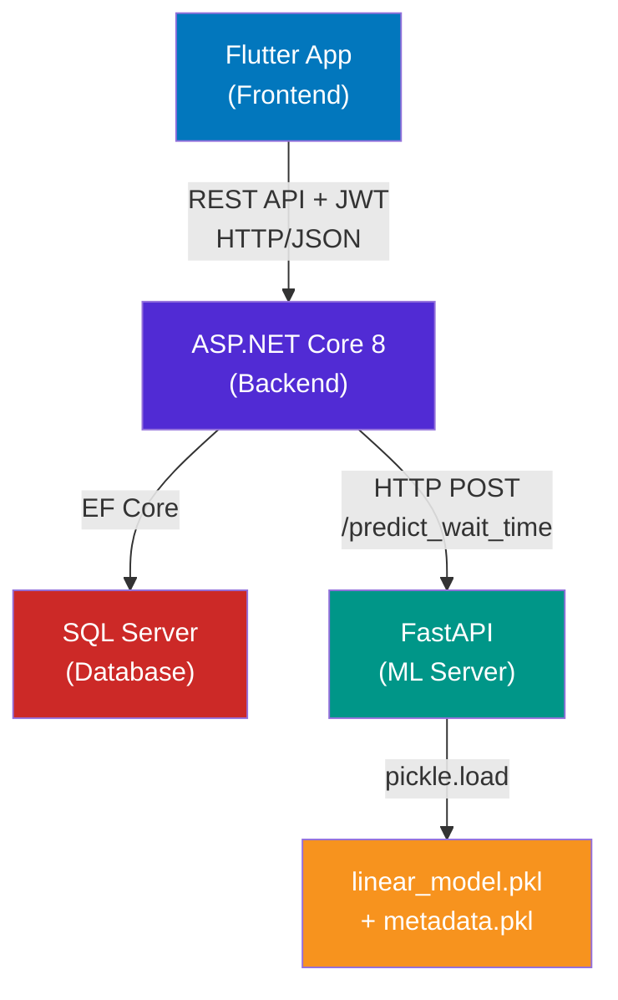

# IntelliQ — Full Project Analysis

## ✅ Is ML Implemented? **YES** — But with Caveats

ML **is implemented** in this project. There is a trained model, a serving API, and a backend service that calls it. However, there are important nuances about how well it's all connected.

---

## 🧠 How the ML Works

### Training Pipeline — [train_model.py](file:///c:/Users/devic/source/repos/Major%20Project/ml/train_model.py)

| Aspect | Detail |
|--------|--------|
| **Algorithm** | `LinearRegression` (from scikit-learn) — **NOT** Random Forest as the README claims |
| **Dataset** | [queue_management_refactored-general.csv](file:///c:/Users/devic/source/repos/Major%20Project/ml/dataset/queue_management_refactored-general.csv) |
| **Target Variable** | `actual_wait_time` (predicts wait time in minutes) |
| **Features** | `facility_id`, `service_type`, `priority_level`, `customer_type`, `queue_status`, `queue_length`, `avg_service_time`, `active_staff_count`, `hour_of_day`, `day_of_week`, etc. |
| **Preprocessing** | LabelEncoder for categoricals, StandardScaler for numerics, median/mode imputation |
| **Artifacts** | `models/linear_model.pkl` (model) + `models/metadata.pkl` (encoders, scaler, defaults, feature names) |

> [!WARNING]
> The README and badges say **Random Forest Regressor**, but `train_model.py` actually trains a **LinearRegression** model. This is a documentation mismatch.

> [!WARNING]
> If the target column `actual_wait_time` is completely empty, the training script **generates synthetic data** using a formula `queue_length × avg_service_time / active_staff_count + noise`. This means the model may be trained on fake data.

### Serving API — [api.py](file:///c:/Users/devic/source/repos/Major%20Project/ml/api.py)

- **Framework**: FastAPI + Uvicorn
- **Endpoint**: `POST /predict_wait_time`
- **Port**: `8000`
- **Input**: A `features` dictionary with partial feature values (missing ones are filled with stored defaults)
- **Output**: `{ "estimated_wait_time_minutes": 12.5, "features_used": {...} }`
- Handles unseen categorical labels gracefully (falls back to class 0)

> [!NOTE]
> There is also an older/alternative API at [api/app.py](file:///c:/Users/devic/source/repos/Major%20Project/ml/api/app.py) that uses `joblib` and expects ALL features explicitly — this is **not the one being used** by the backend.

---

## 🔗 Integration Assessment: Frontend ↔ Backend ↔ ML

### Connection Map



---

### ✅ Backend ↔ ML: **Properly Connected**

| Component | Status | Details |
|-----------|--------|---------|
| [MlPredictionService.cs](file:///c:/Users/devic/source/repos/Major%20Project/backend/Smart_Queue/Services/MlPredictionService.cs) | ✅ Implemented | HttpClient calling `http://127.0.0.1:8000/predict_wait_time` |
| DI Registration in [Program.cs](file:///c:/Users/devic/source/repos/Major%20Project/backend/Smart_Queue/Program.cs#L55-L58) | ✅ Registered | `AddHttpClient<MlPredictionService>` with base address `http://127.0.0.1:8000` |
| [QueueService.cs](file:///c:/Users/devic/source/repos/Major%20Project/backend/Smart_Queue/Services/QueueService.cs) | ✅ Integrated | ML called in two key places |
| Fallback Logic | ✅ Implemented | If ML API is offline → `(queueLength + 1) * 15` minutes |

**Where ML is actually used in the backend:**

1. **Token Creation** ([QueueService.cs:L57-L64](file:///c:/Users/devic/source/repos/Major%20Project/backend/Smart_Queue/Services/QueueService.cs#L57-L64)) — When a user joins a queue, the ML model predicts their wait time, and it's stored in the `EstimatedWaitMinutes` field of the token.

2. **Queue Recalculation** ([QueueService.cs:L128-L137](file:///c:/Users/devic/source/repos/Major%20Project/backend/Smart_Queue/Services/QueueService.cs#L128-L137)) — When staff calls the next person, all remaining tokens get their wait times re-predicted via the ML model.

### ✅ Frontend ↔ Backend: **Properly Connected**

| Component | Status | Details |
|-----------|--------|---------|
| [api_service.dart](file:///c:/Users/devic/source/repos/Major%20Project/Frontend/lib/services/api_service.dart) | ✅ Comprehensive | 600+ lines covering all API endpoints |
| Auth (JWT) | ✅ Working | Token stored in SharedPreferences, sent via `Authorization: Bearer` header |
| Queue Operations | ✅ Connected | `joinQueue()`, `callNext()`, `getQueueTracking()`, `completeToken()` |
| Appointments | ✅ Connected | `bookAppointment()`, `getMyAppointments()` |
| Dashboard/Analytics | ✅ Connected | `getUserDashboard()`, `getAdminDashboard()`, `getStaffDashboard()` |

### ⚠️ Frontend ↔ ML (via Backend): **Partially Connected**

> [!IMPORTANT]
> The ML predictions **do reach the frontend**, but **indirectly** — through the `EstimatedWaitMinutes` field on queue tokens. When a user books and gets a token, the wait time they see comes from the ML model.

**However, two major frontend screens use HARDCODED DATA instead of live ML predictions:**

| Screen | File | Issue |
|--------|------|-------|
| **Smart Slot Screen** | [smart_slot_screen.dart](file:///c:/Users/devic/source/repos/Major%20Project/Frontend/lib/screens/user/smart_slot_screen.dart#L13-L31) | All slot recommendations, crowd levels, and wait times are **hardcoded** in local arrays (lines 13-31). No API call is made. |
| **AI Prediction Screen** | [ai_prediction_screen.dart](file:///c:/Users/devic/source/repos/Major%20Project/Frontend/lib/screens/admin/ai_prediction_screen.dart) | All gauges (65% crowd), hourly forecasts (25m, 15m, 10m...), resource recommendations — **all hardcoded**. No API call. |

---

## 📊 Summary Verdict

| Layer | Connection | Working? |
|-------|-----------|----------|
| **Flutter → ASP.NET Backend** | REST + JWT | ✅ Yes — all CRUD, auth, queue, appointments, dashboards |
| **ASP.NET Backend → FastAPI ML** | HTTP POST `/predict_wait_time` | ✅ Yes — with graceful fallback |
| **ML Model Training** | scikit-learn pipeline | ✅ Yes — trained artifacts exist (`linear_model.pkl`, `metadata.pkl`) |
| **ML in Queue Flow** | Token creation + recalculation | ✅ Yes — `EstimatedWaitMinutes` comes from ML |
| **Smart Slot Screen** | Frontend → ML predictions | ❌ **No** — hardcoded dummy data |
| **AI Prediction Screen (Admin)** | Frontend → ML predictions | ❌ **No** — hardcoded dummy data |

---

## 🔴 Key Issues Found

1. **README says Random Forest, code uses Linear Regression** — documentation mismatch
2. **Smart Slot Screen is purely cosmetic** — displays static data, never calls the API
3. **AI Prediction Screen (Admin) is purely cosmetic** — all numbers are hardcoded
4. **ML model may be trained on synthetic data** — if `actual_wait_time` column was empty, the script fills it with a formula
5. **Two ML API files exist** — [api.py](file:///c:/Users/devic/source/repos/Major%20Project/ml/api.py) (the one in use) and [api/app.py](file:///c:/Users/devic/source/repos/Major%20Project/ml/api/app.py) (unused, incompatible)

---

## ✅ What IS Working End-to-End

The core **queue management flow** is fully integrated:

```
User books appointment (Flutter)
  → Backend creates token + calls ML API for wait prediction
    → ML model returns estimated wait time
      → Token with ML-predicted wait time stored in DB
        → User sees predicted wait time in their token/tracking screen
          → When staff calls next, remaining tokens get re-predicted by ML
```

This is the **real, working ML integration** in your project. The "Smart Slot" and "AI Prediction" screens are presentation-layer mockups that look great but don't pull live data.
