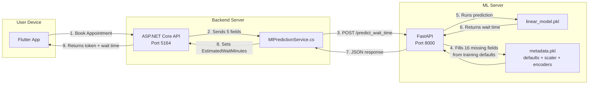

# IntelliQ — ML Prediction Architecture & Test Results

## System Architecture



---

## Complete Workflow (Step by Step)

### Step 1: User books an appointment (Flutter App)
User selects a service provider, picks a service, and books. The Flutter app calls the ASP.NET API.

### Step 2: ASP.NET creates a Queue Token (`QueueService.cs`)
The backend collects the data it already knows:

| Field              | Where it comes from              |
| ------------------ | -------------------------------- |
| `queue_length`     | Count of waiting tokens in DB    |
| `hour_of_day`      | `DateTime.Now.Hour`              |
| `active_staff_count` | Count of active counters in DB |
| `service_type`     | Service name from DB             |
| `priority_level`   | Set to "normal" (default)        |

### Step 3: `MlPredictionService.cs` sends these 5 fields to FastAPI
```json
POST http://127.0.0.1:8000/predict_wait_time

{
  "features": {
    "queue_length": 10,
    "hour_of_day": 14,
    "active_staff_count": 2,
    "service_type": "consultation",
    "priority_level": "normal"
  }
}
```

### Step 4: FastAPI fills in the remaining 16 fields
The Python API loads `metadata.pkl` which contains the **median/mode values** from the training dataset. It fills every missing field automatically:

| Missing Field         | Default Value (from training) |
| --------------------- | ----------------------------- |
| `facility_id`         | "F003" (most frequent)        |
| `age`                 | 55.0 (median)                 |
| `customer_type`       | "elderly" (most frequent)     |
| `wait_tolerance`      | 16.0 (median)                 |
| `queue_position`      | 9.0 (median)                  |
| `historical_avg_wait` | 20.0 (median)                 |
| `avg_service_time`    | 9.8 (median)                  |
| `staff_availability`  | 0.82 (median)                 |
| `day_of_week`         | 3.0 (median)                  |
| `is_holiday`          | 0.0 (median)                  |
| `peak_hours`          | 0.0 (median)                  |
| `no_show_indicator`   | 0.0 (median)                  |
| `service_counters`    | 4.0 (median)                  |
| `operational_hours`   | 10.0 (median)                 |
| `feedback_score`      | 3.8 (median)                  |
| `queue_status`        | "critical" (most frequent)    |

### Step 5: Model predicts the wait time
The Linear Regression model (`linear_model.pkl`) runs on all 21 scaled features and returns a prediction in minutes.

### Step 6: Result flows back
`FastAPI → MlPredictionService.cs → QueueService.cs → QueueToken.EstimatedWaitMinutes → Flutter App`

---

## The Prediction Endpoint

```
POST  http://127.0.0.1:8000/predict_wait_time
```

**Request Body:**
```json
{
  "features": {
    "queue_length": 10,
    "service_type": "consultation",
    "priority_level": "normal",
    "hour_of_day": 14,
    "active_staff_count": 2
  }
}
```
> You can send **any subset** of the 21 features. Missing ones are filled automatically.

**Response:**
```json
{
  "estimated_wait_time_minutes": 61.1,
  "features_used": { ... all 21 features that were sent to the model ... }
}
```

---

## Test Results

| # | Scenario | Queue | Staff | Hour | Service | Priority | Predicted Wait |
|---|----------|-------|-------|------|---------|----------|----------------|
| 1 | Normal load | 5 | 3 | 10am | consultation | normal | **24.4 min** |
| 2 | Peak hour rush | 15 | 2 | 2pm | complaint | urgent | **78.5 min** |
| 3 | Short queue | 2 | 5 | 9am | payment | normal | **~0 min** |
| 4 | Worst case | 20 | 1 | 5pm | renewal | elderly | **113.9 min** |

> [!NOTE]
> The predictions make practical sense: more people + fewer staff = longer wait. Short queues with many staff = almost no wait. The model learned these patterns from the dataset!

---

## Fallback Safety

If the FastAPI server ever goes down, `MlPredictionService.cs` catches the error and falls back to:
```csharp
private int CalculateFallback(int queueLength)
{
    return (queueLength + 1) * 15;  // Simple math fallback
}
```
**The app never crashes** — it just uses a basic formula until the ML server is back.
